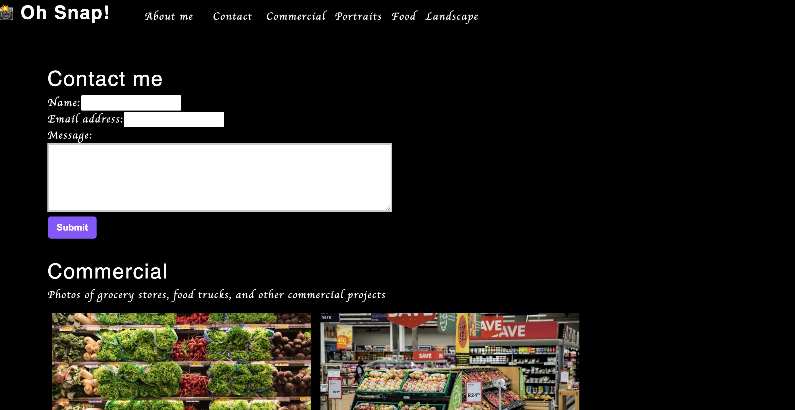

# Photo Port
### User Story

As a user looking for a portfolio style website, I would like an application that will showcase all of my photography work. When a user visits the homepage, they are presented with a navigation bar where they can click the about me section to tread more about me. They can click categories of to see the photo galleries in each. They can also contact me by using the contact form. 
### Features
This project is a a portfolio Single Page Application website 
This website features a navigation bar to about me, contact annd gallery pages for different categories.
The contact will feature a form to complete to contact the owber of the website.
The categories will display all images in that category and they can be clicked and enlarged into a bigger modal.

### badges

## Table of Contents

- [installation](#installation)
- [contribution guidelines](#contribution)
- [Test Instructions](#testing)
- [License](#license)
- [Questions](#questions)

### Installation
Please clone the github repo here :
https://github.com/Vinyldude8896/photo-port

#### Install Dependencies
Install dependencies using npm install

#### Run the program
In the root directory run : npm start
Go to your browser location : http://localhost:3000/
Test the website by nagivating through the different sections and clicking on pictures in the gallery

#### Deployed app
The live github page is here: 
/Vinyldude8896/photo-port/.

### Contribution Guidelines
N/A as of yet
### Testing
To test this app:
1. Clone the repo here : https://github.com/Vinyldude8896/photo-port
2. Install dependencies using npm install at the root folder.
3. at the root folder run the command npm start - this will build and run the server.
4. Go to http://localhost:3000/
7. Test the different functionality of the webpage
8 Alternatively you can go here to test the webpage : /Vinyldude8896/photo-port/

### Questions
    email address : kevinnivek@me.com
    - additional instructions 
    I can be contacted by phone as well, but prefer email contact first.

### Images of example readme.md

